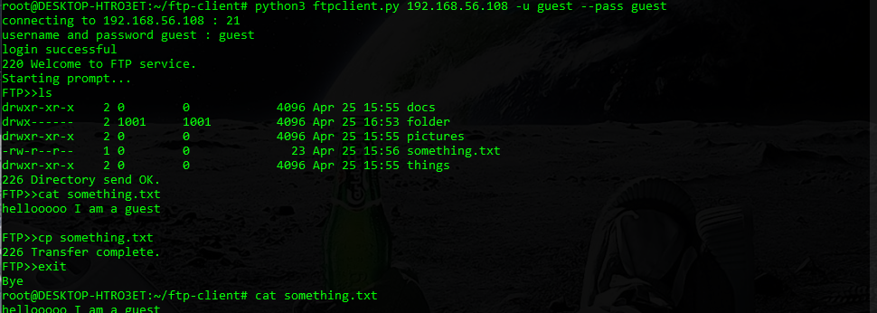

# FTP client

simple ftp client on command line interface written in python 3.

## Installation:

### Required:

	python 3.8

###	installing:
	
	git clone https://github.com/jonatan5524/ftp-client
	cd ftp-client
	python ftpclient.py

## Options:
	
	python3 ftpclient.py -h
	
	usage: ftpclient.py [-h] [-p PORT] [-u USERNAME] [--password PASSWORD] host

	positional arguments:
		host                  host name or ip address of the ftp server

	optional arguments:
		-h, --help            show this help message and exit
		-p PORT, --port PORT  port number to onnect to, defualt port nubmer: 21
		-u USERNAME, --username USERNAME username to the ftp server, defualt username: anonymous
		--password PASSWORD, --pass PASSWORD password to the ftp server, defualt password: anonymous

## Example:

	